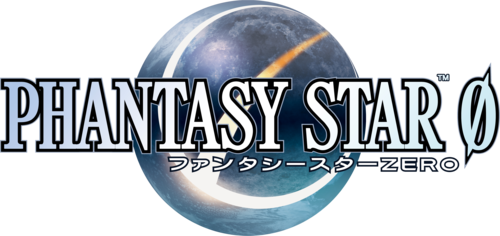

  

Phantasy Star Zero, rebuilt in Godot as a fan-made action RPG in the shape of Phantasy Star Online.

The Nintendo DS original has a combat system and overworld that never quite lived up to its PSO heritage. This project takes the PSZ world and characters and reworks them around PSO's real-time combat, technique casting, class system, and quest/field loop. Explore instanced field areas, clear rooms, fight through boss encounters, gear up, cast technics, and take missions from the guild.

Play on desktop, Android, or in your browser. Join the [Discord](https://discord.gg/qGzGK9UY) to follow development, playtest, or pitch in.

  
  
  
  

## What's playable right now

- **Combat** — melee combos (saber, sword, daggers, spear, rod, wand), ranged weapons (handgun, rifle, mechgun), and technique casting (Foie, Barta, Zonde + Gi/Ra variants, plus support and healing technics)
- **14 classes** — Hunters, Rangers, and Forces with PSU-style archetypes, innate weapon bonuses, and technique limits
- **Instanced fields** — grid-generated rooms per area (valley, wetlands, paru, snowfield, makara, arca, tower), gated enemy waves, bosses on the end room
- **Quests** — hand-authored missions with companion NPCs, briefing dialog at the guild, dynamic fragment/item objectives, telepipe return
- **City hub** — shops (weapon, item, technique, crafting, tekker), mag feeding, save/load, character creation across 14 classes
- **Action Palette** — PSO-style swappable hotbar: combat actions, consumables, and technics across three pages

## In progress

- Menu overhaul: PSO-style start menu and quick-item palette (see issues [#140](../../issues/140), [#141](../../issues/141))
- Controller pass: DualShock/Xbox/Switch mappings, PSP2i-style Select-button menu, PSU-style dpad shortcuts ([#124](../../issues/124), [#125](../../issues/125), [#126](../../issues/126), [#127](../../issues/127))
- Shop UX: multi-item purchases, clear Yes/No confirmation with button prompts ([#137](../../issues/137))
- Footstep, weapon, and enemy SFX pass against a full PSO label sheet (common sfx labels imported; per-surface footsteps landing)
- Story pass across the eight story missions for narrative coherence

## Considered for later

- Photon Arts (weapon-specific special attacks, [#95](../../issues/95))
- PSO-style trap system (Heat / Ice / Light / Heal, [#94](../../issues/94))
- Android UI overflow fixes for smaller screens ([#97](../../issues/97))
- Item telepipes and first-room return teleporter ([#136](../../issues/136))
- Boosted Aura elite enemies ([#108](../../issues/108))

## Screenshot

_TODO — add a representative screenshot of the title screen or a combat moment._

## Team

- **@kion-dgl** — code, design, everything day-to-day
- **Rozalin** — playtesting, sound-effect labeling, UI mockups, character portraits

## Credits

- **Phantasy Star Zero** original game by SEGA / Sonic Team
- Extensive sound work and playtest feedback from the PSO community on the project Discord
- **Input Prompts** and **Nature Kit** by [Kenney](https://kenney.nl/assets/nature-kit) — CC0 (public domain)
- Character-portrait art by **Rozalin**
- Runs on [Godot 4.5](https://godotengine.org/) — thanks to the Godot contributors and maintainers

## License

PSZ Godot is free software: you can redistribute it and/or modify it under the terms of the GNU General Public License as published by the Free Software Foundation, either version 3 of the License, or (at your option) any later version. See [LICENSE](LICENSE) for the full text.

Game assets (stage models, textures, music) derived from Phantasy Star titles remain the property of SEGA and are not redistributed as part of this repository. Players download them separately via the bootstrap scene on first launch.

---

> This is an unofficial fan project. Phantasy Star, Phantasy Star Online, and Phantasy Star Zero are trademarks of SEGA. No affiliation with or endorsement by SEGA is implied.
