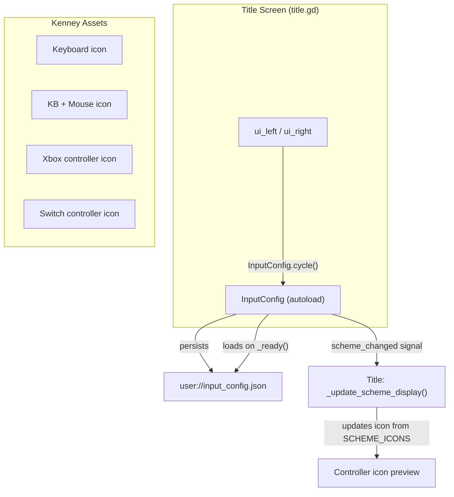
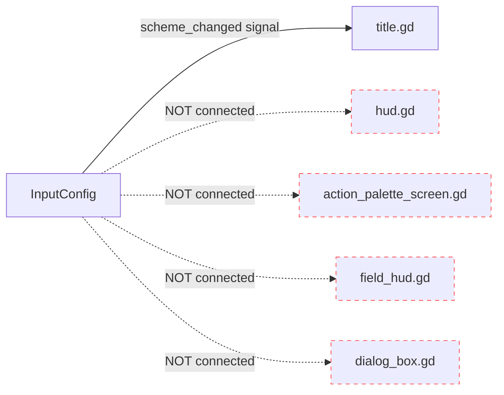
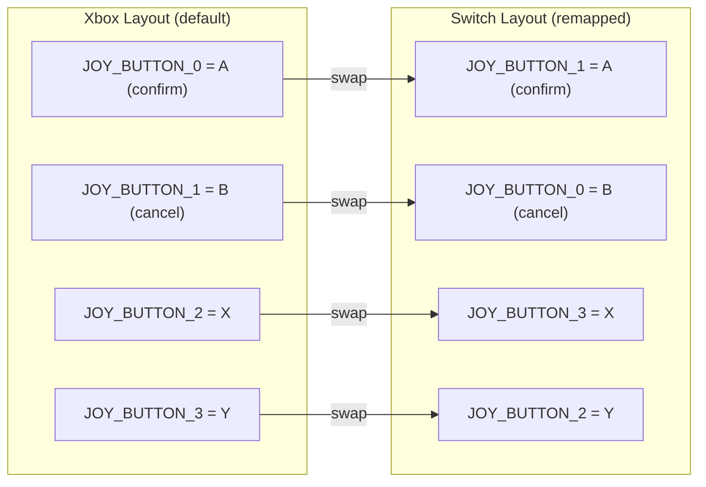

# Input System

How the player's control scheme selection flows through the game.

## Control Scheme Selection

The player selects a control scheme on the **title screen**. This choice persists to `user://input_config.json` and MUST propagate to every screen that displays button prompts.

## Current Consumers

> Red dashed = **should** consume InputConfig but currently does not.

## Scheme Constants

| Scheme ID   | Label         | Button Layout | Icon Source                     |
|-------------|---------------|---------------|---------------------------------|
| `keyboard`  | Keyboard      | N/A           | `kenney_input-prompts/Keyboard` |
| `kb_mouse`  | KB + Mouse    | N/A           | `kenney_input-prompts/Mouse`    |
| `xinput`    | Xbox / XInput | Standard ABXY | `kenney_input-prompts/Xbox`     |
| `switch`    | Switch        | Swapped A/B, X/Y | `kenney_input-prompts/Switch` |

## Switch Button Remapping

When `InputConfig.current_scheme == "switch"`, `_apply_button_mapping()` swaps joypad face buttons so physical labels match on-screen prompts:

## Behavioral Contracts

These are the expected behaviors. If any of these break, something regressed.

### Contract 1: Scheme persists across sessions
- `InputConfig._ready()` MUST load from `user://input_config.json`
- `InputConfig.cycle()` MUST save to `user://input_config.json`
- A player who selects Xbox on the title screen MUST see Xbox selected on next launch

### Contract 2: All button prompt UIs reflect current scheme
- **Title screen**: MUST show correct controller icon for selected scheme
- **HUD interaction prompts**: SHOULD show scheme-appropriate button label (e.g., "E" vs "A" vs "B")
- **Action palette**: SHOULD show scheme-appropriate face button icons on each slot
- **Dialog boxes**: SHOULD show scheme-appropriate "advance" prompt

### Contract 3: Switch remapping applies to gameplay
- When scheme is `switch`, `_apply_button_mapping()` MUST be called
- Confirm action MUST map to physical A button (JOY_BUTTON_1 on Switch)
- Cancel action MUST map to physical B button (JOY_BUTTON_0 on Switch)

### Contract 4: Scheme change propagates at runtime
- Changing scheme MUST emit `scheme_changed` signal
- ALL connected listeners MUST update their displays immediately
- No scene reload should be required

## Gap Analysis

Current gaps where InputConfig is NOT consumed but SHOULD be:

| System | File | Issue |
|--------|------|-------|
| HUD interaction prompt | `scripts/3d/ui/hud.gd` | Shows generic "interact" text, not scheme-specific button icon |
| Action palette screen | `scripts/2d/action_palette_screen.gd` | Uses hardcoded "A/B" hint text regardless of scheme |
| Field HUD | `scripts/3d/field/field_hud.gd` | Action diamond shows slot names but not button icons |
| Dialog box | `scripts/3d/ui/dialog_box.gd` | "Advance" prompt not scheme-aware |
