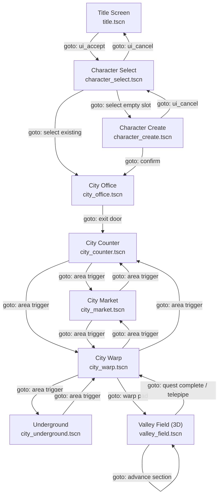
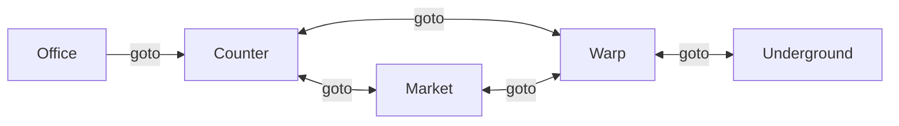
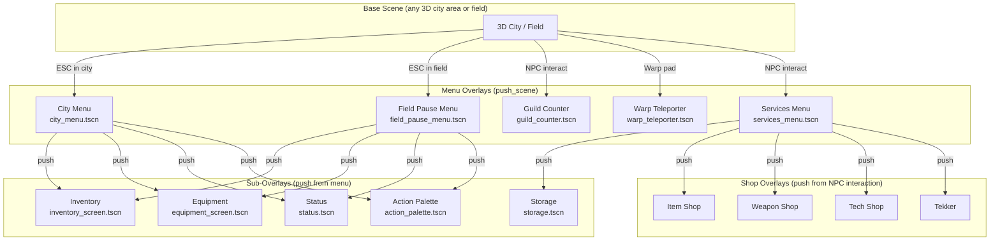
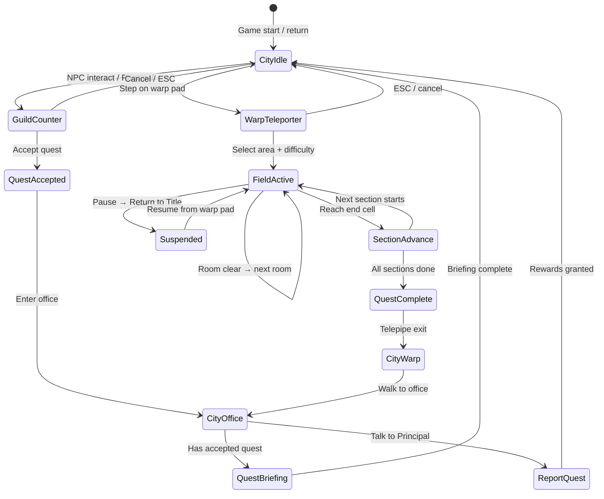
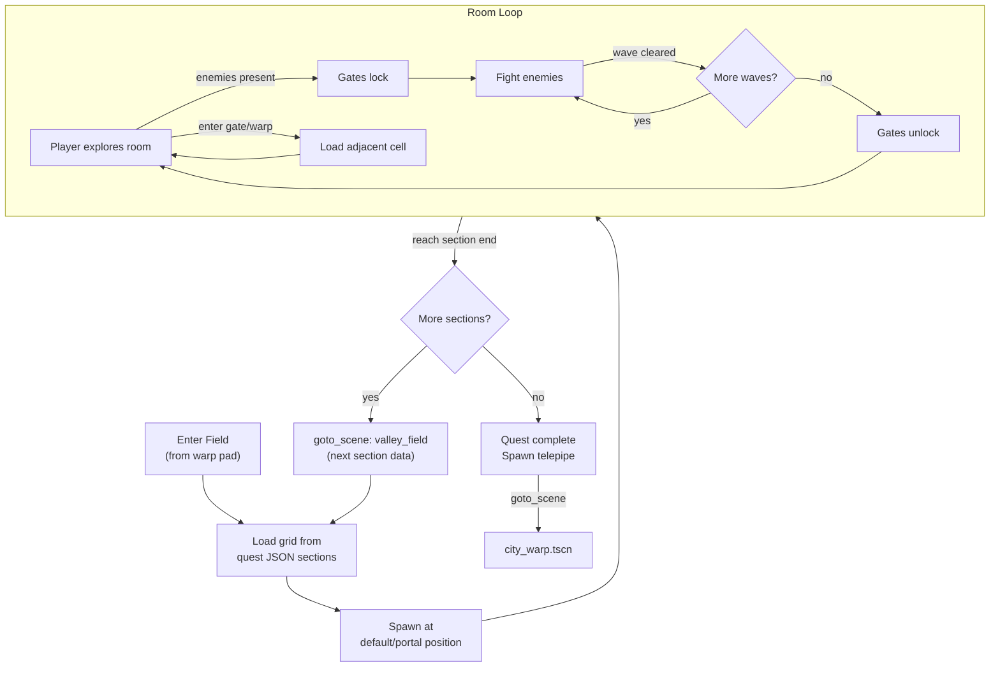

# Scene Flow

Every scene transition in the game, what triggers it, and how SceneManager handles it.

## Transition Methods

SceneManager provides three transition types:

| Method | Behavior | Use Case |
|--------|----------|----------|
| `goto_scene(path, data)` | Replace current scene, clear all overlays, fade transition | Major navigation (city → field) |
| `push_scene(path, data)` | Overlay on top, dim background, preserve base scene | Menus, shops, dialogs |
| `pop_scene(data)` | Dismiss top overlay, re-enable previous scene | Close menu/shop |

## Main Game Flow

## City Hub Navigation

All city areas extend `city_area_base.gd` and transition between each other via area triggers at zone boundaries.

## Overlay Stack (push/pop)

These scenes are pushed as overlays and popped with ESC / ui_cancel.

## Quest Flow State Machine

## Field Progression Detail

## Data Passed Between Scenes

SceneManager stores transition data accessible via `get_transition_data()`.

| Transition | Data Keys | Purpose |
|------------|-----------|---------|
| → valley_field | `current_cell_pos`, `spawn_edge`, `keys_collected` | Resume position in grid |
| → city_office | `spawn_key` ("intro" for first visit) | Trigger intro cutscene |
| → guild_counter | `npc_model_path`, `npc_display_name` | Show NPC in counter scene |
| → city areas | `spawn_key` | Player spawn position |
| ← guild_counter (pop) | `quest_accepted: true` | Notify city that quest was accepted |

## Behavioral Contracts

### Contract 1: All scene transitions go through SceneManager
- No direct calls to `get_tree().change_scene_to_file()`
- SceneManager handles fade transitions, overlay stacking, and data passing
- Breaking this contract causes missing transitions or stale overlays

### Contract 2: Overlay stack is LIFO
- `push_scene` adds to top of stack
- `pop_scene` removes from top only
- `goto_scene` clears the entire stack
- Menus MUST pop themselves before pushing sub-menus (or the stack grows unbounded)

### Contract 3: City areas preserve player state
- When transitioning between city areas, `CityState` MUST save player position/rotation
- Returning to a city area MUST restore the player near the exit they left from
- `spawn_key` in transition data overrides this (e.g., "intro" spawn)

### Contract 4: Field sections chain correctly
- Advancing a section calls `goto_scene` with the SAME valley_field scene but new section data
- `keys_collected` MUST carry forward across sections (keys persist within a quest run)
- `current_cell_pos` MUST be set to the new section's start position

### Contract 5: Quest state gates transitions
- Warp pad MUST check `SessionManager.has_accepted_quest()` before allowing field entry
- Guild counter MUST check quest status to show correct options (accept/cancel/report)
- Office briefing MUST only trigger when `has_accepted_quest()` is true
