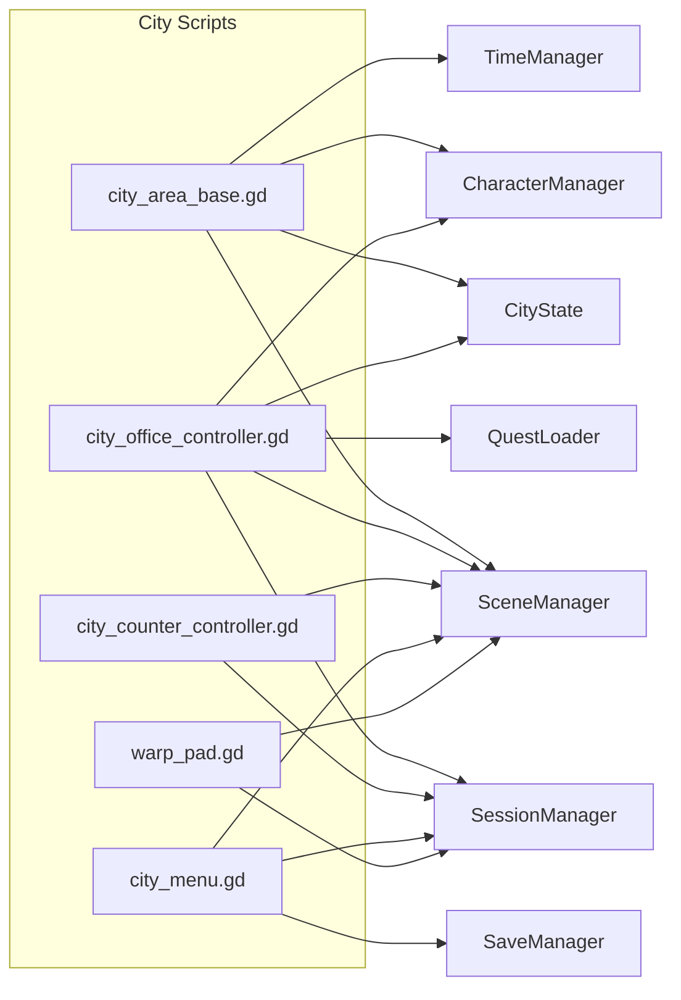
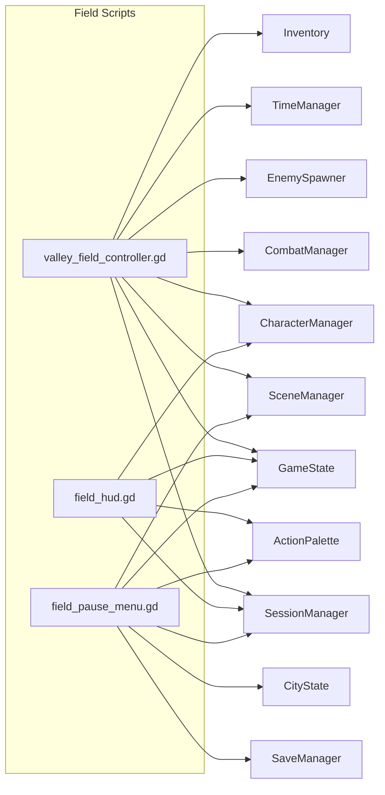
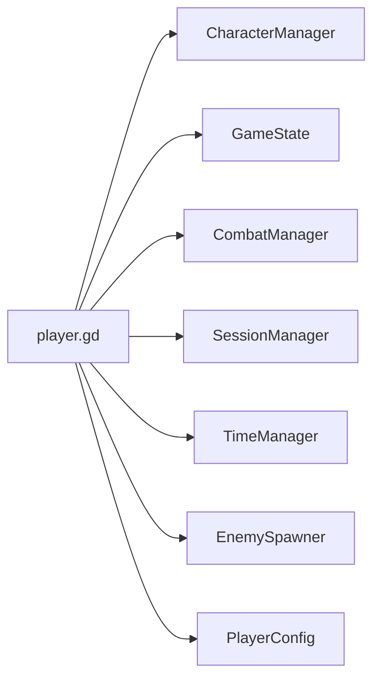
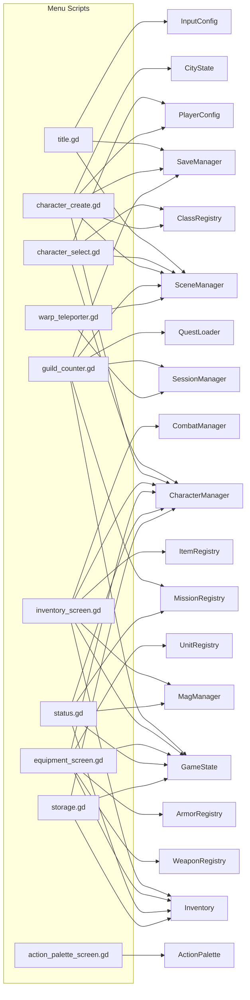
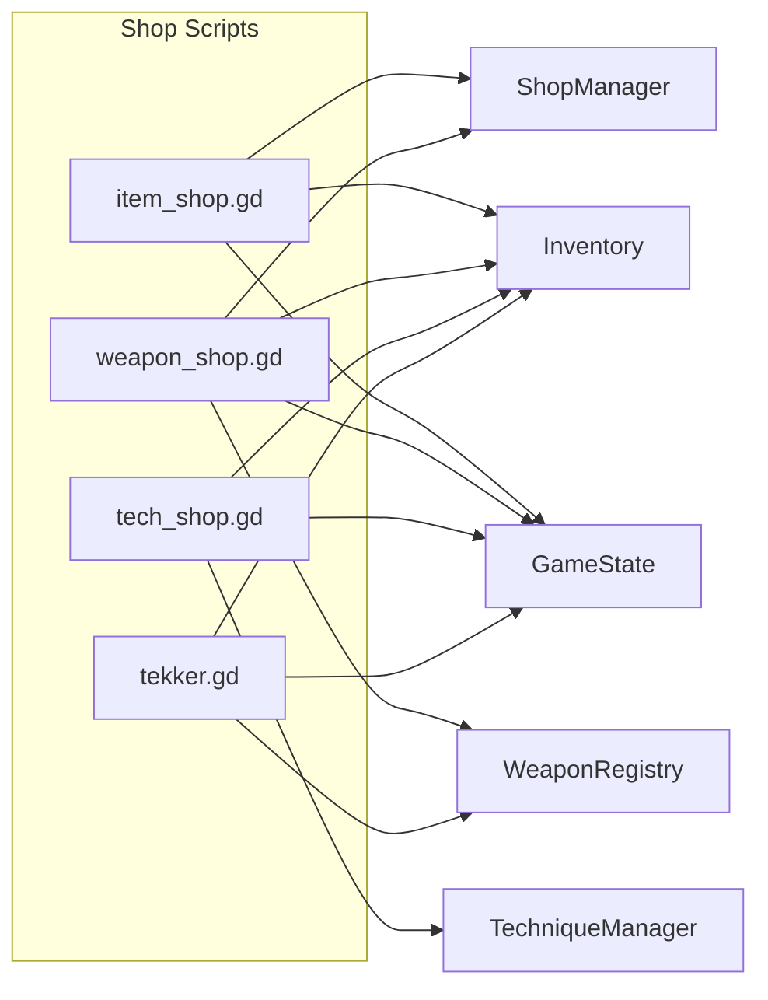

# System Dependencies

Maps every autoload-to-autoload dependency and groups non-autoload consumers by subsystem.

## Autoload Dependency Graph

```mermaid
graph TD
    subgraph "Registries (pure data, no dependencies)"
        ItemReg["ItemRegistry"]
        WeaponReg["WeaponRegistry"]
        ArmorReg["ArmorRegistry"]
        EnemyReg["EnemyRegistry"]
        ClassReg["ClassRegistry"]
        ConsumableReg["ConsumableRegistry"]
        ShopReg["ShopRegistry"]
        UnitReg["UnitRegistry"]
        PhotonArtReg["PhotonArtRegistry"]
        MissionReg["MissionRegistry"]
        DropReg["DropRegistry"]
        MaterialReg["MaterialRegistry"]
        ModifierReg["ModifierRegistry"]
        SetBonusReg["SetBonusRegistry"]
    end

    subgraph "Standalone (no autoload dependencies)"
        SceneManager
        EnemySpawner
        CityState
        PlayerConfig
        TimeManager
        QuestLoader
        ActionPalette
        InputConfig
        MagManager
    end

    subgraph "Composite (depend on other autoloads)"
        GameState
        Inventory
        CharacterManager
        SaveManager
        CombatManager
        ShopManager
        SessionManager
        TechniqueManager
    end

    %% Inventory dependencies
    Inventory --> ItemReg
    Inventory --> WeaponReg
    Inventory --> ArmorReg
    Inventory --> UnitReg
    Inventory --> ConsumableReg
    Inventory --> MaterialReg
    Inventory --> ModifierReg
    Inventory --> TechniqueManager
    Inventory --> GameState

    %% CharacterManager dependencies
    CharacterManager --> ClassReg
    CharacterManager --> Inventory
    CharacterManager --> GameState
    CharacterManager --> ActionPalette

    %% SaveManager dependencies
    SaveManager --> CharacterManager
    SaveManager --> GameState

    %% CombatManager dependencies
    CombatManager --> CharacterManager
    CombatManager --> ClassReg
    CombatManager --> WeaponReg
    CombatManager --> ArmorReg
    CombatManager --> SetBonusReg
    CombatManager --> TechniqueManager
    CombatManager --> PhotonArtReg
    CombatManager --> DropReg
    CombatManager --> Inventory

    %% ShopManager dependencies
    ShopManager --> ShopReg
    ShopManager --> CharacterManager
    ShopManager --> Inventory
    ShopManager --> GameState
    ShopManager --> WeaponReg

    %% SessionManager dependencies
    SessionManager --> QuestLoader
    SessionManager --> MissionReg

    %% TechniqueManager dependencies
    TechniqueManager --> ClassReg
```

## Dependency Depth

How deep in the dependency chain each autoload sits. Higher depth = more transitive risk.

| Depth | Autoloads |
|-------|-----------|
| 0 (leaf) | All Registries, SceneManager, EnemySpawner, CityState, PlayerConfig, TimeManager, QuestLoader, ActionPalette, InputConfig, MagManager, GameState |
| 1 | TechniqueManager, SessionManager |
| 2 | Inventory (→ registries + GameState + TechniqueManager) |
| 3 | CharacterManager (→ Inventory → ...) |
| 4 | SaveManager, CombatManager, ShopManager (→ CharacterManager → ...) |

## Non-Autoload Consumers by Subsystem

### City Subsystem (scripts/3d/city/)

### Field Subsystem (scripts/3d/field/)

### Player (scripts/3d/player/)

### 2D Menus (scripts/2d/)

### Shops (scripts/2d/shops/)

## Coupling Hotspots

Systems with the most incoming dependencies (most coupled, highest regression risk):

| Autoload | Incoming Deps (autoloads) | Incoming Deps (scripts) | Risk |
|----------|--------------------------|------------------------|------|
| GameState | Inventory, CharacterManager, ShopManager, SaveManager | 15+ scripts | HIGH |
| CharacterManager | SaveManager, CombatManager, ShopManager | 10+ scripts | HIGH |
| Inventory | CombatManager, CharacterManager | 12+ scripts | HIGH |
| SceneManager | (none) | 15+ scripts | MEDIUM |
| SessionManager | (none) | 10+ scripts | MEDIUM |
| ClassRegistry | CharacterManager, CombatManager, TechniqueManager | 3 scripts | LOW |

## Behavioral Contracts

### Contract 1: Registries are stateless
- Registry autoloads MUST NOT reference other autoloads
- They load data once in `_ready()` and serve lookups
- Changing a registry MUST NOT have side effects on game state

### Contract 2: SaveManager only talks to CharacterManager + GameState
- Save/load MUST go through CharacterManager (character data) and GameState (shared storage)
- SaveManager MUST NOT directly access Inventory, CombatManager, or any other system
- All saveable state MUST be accessible through these two entry points

### Contract 3: SessionManager is the quest authority
- Only SessionManager tracks quest progress (accepted, suspended, completed)
- QuestLoader reads files but does not track state
- Field controllers read session state but do not write quest progress directly

### Contract 4: CombatManager does not persist
- Combat state lives only during active combat encounters
- CombatManager reads from CharacterManager/Inventory but MUST NOT write back directly
- Rewards (XP, drops, meseta) are applied by the field controller after combat resolution
