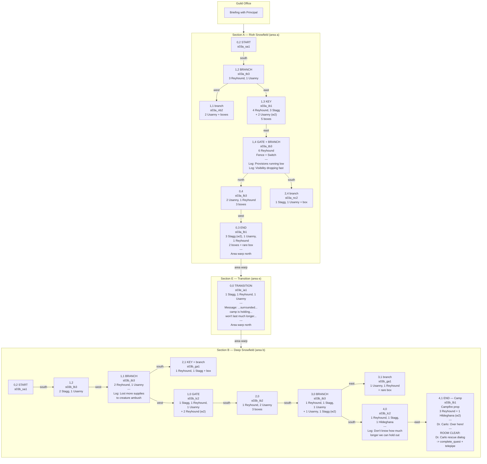

# Quest: Static in the Snow

**Location:** Rioh Snowfield | **Theme:** Search & Rescue (solo)  
**Objective:** A research team has gone silent in the snowfield. Locate them.

No companion. No client in the office. The player goes in on a lost-signal report from the Principal, traces the expedition's path through their logs, and discovers Dr. Carlo at the camp. First meeting.

## Briefing (Guild Office)

| # | Speaker | Dialog |
|---|---------|--------|
| 1 | Principal | We've lost contact with a research team in the snowfield. Their last transmission was mostly static. |
| 2 | Principal | They were conducting survey work in the deep snow region. We don't know what happened. |
| 3 | Principal | Head to the snowfield and locate the expedition camp. Bring the team home safely. |

## Mission Flow

## All Dialog (in play order)

### Section A — Expedition Logs (missable, interact to read)

| Cell | Text |
|------|------|
| 1,4 | Expedition Log: We're finding it hard to avoid encounters. Provisions are starting to run low. |
| 1,4 | Expedition Log: Visibility dropping fast. Going to push deeper despite the conditions. |

### Section E — Transition

| Cell | Type | Text |
|------|------|------|
| 0,0 | Message | ...surrounded... camp is holding... won't last much longer... |

### Section B — Expedition Logs (missable, interact to read)

| Cell | Text |
|------|------|
| 1,1 | Expedition Log: We lost more supplies to another creature ambush. The wildlife here is more aggressive than anything in the survey data. |
| 4,0 | Expedition Log: I don't know how much longer we can hold out. Almost everything is gone now. |

### Section B — Camp Rescue (cell 4,1)

| Type | Speaker | Dialog |
|------|---------|--------|
| Dialog (enter) | Dr. Carlo | Over here! They've surrounded the camp! |
| Dialog (room clear) | Dr. Carlo | Thank you. The creatures came out of nowhere, we lost contact trying to call for help. |
| Dialog (room clear) | Dr. Carlo | We owe you one. I'll make sure the Principal hears about this. |
| *action* | -- | complete_quest + telepipe |

## Enemy Roster

| Enemy | Display Name | Count | Notes |
|-------|-------------|-------|-------|
| reyhound | Reyhound | ~25 | Wolf, most common. All sections. |
| usanny | Usanny | ~14 | Rabbit, secondary. All sections. |
| stagg | Stagg | ~12 | Deer, mid-tier. Sections A and B. |
| hildeghana | Hildeghana | 2 | Female gorilla. Section B only (4,0 and 4,1 wave 2). Escalation near camp. |

## Mechanics

- **Key + Gate (Section A):** Cell 1,3 drops a key. Gate at 1,4 south blocks access to branch cell 2,4.
- **Fence + Switch (Section A):** Cell 1,4 has a fence (link "a") cleared by a step switch in the same room.
- **Key + Gate (Section B):** Cell 2,1 drops a key. Gate at 1,0 south blocks deeper progression.
- **Waves:** Several cells have wave 2 enemies that spawn after wave 1 is cleared.
- **Area Warps:** Section A exits north from 0,3. Section E exits north. Section B exits south from 4,1 (telepipe).
- **Story Prop:** Campfire at the expedition camp (cell 4,1).

## Narrative Arc

1. **Briefing:** Lost signal from a research team. Principal sends the player alone with minimal info.
2. **Section A (Outer Snowfield):** Hostile territory. First expedition logs found. Provisions running low, visibility dropping. The team pushed deeper.
3. **Transition:** A desperate radio fragment. The situation is worse than expected.
4. **Section B (Deep Snowfield):** More dire logs. Creatures took their supplies. Hildeghana appear near the camp, escalating the threat.
5. **Camp Rescue:** Dr. Carlo calls for help. Clear all enemies. Brief thanks -- first meeting, not a big moment. He'll matter more later.

## Design Notes

- **Solo mission by design.** No companion. The isolation makes the snowfield feel dangerous and the expedition logs more impactful.
- **Dr. Carlo is discovered, not introduced.** He's not in the briefing. The player meets him for the first time at the camp. Like PSO's "The Fake in Yellow" introducing Jean Carlo Montague offhand. He becomes important in later quests.
- **Expedition logs are missable flavor.** Not required for quest completion. Reward for exploration.
- **Hard mode potential:** Add quest items (recover research equipment/data samples) for a collection objective layer.
