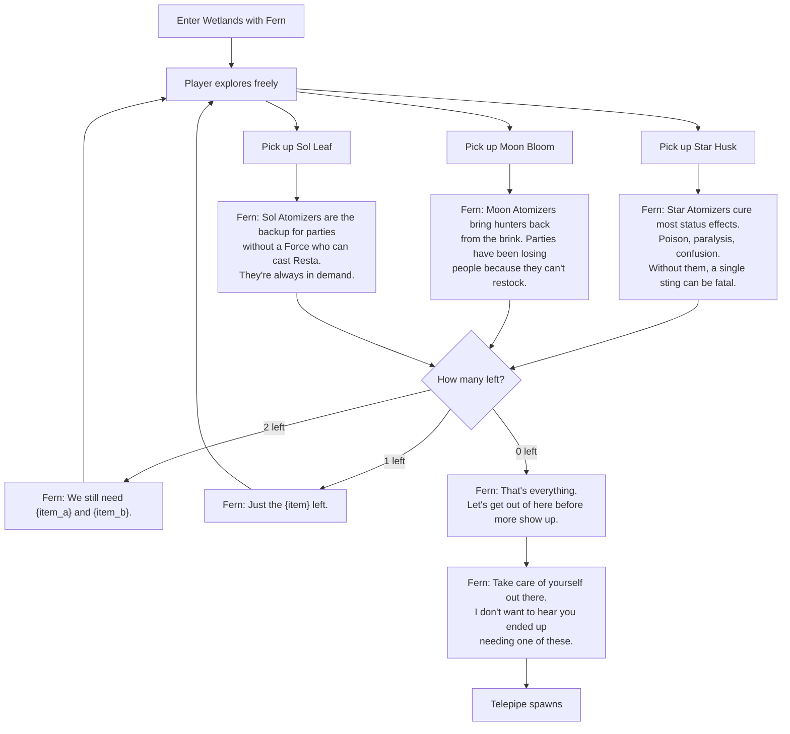

# Apothecary's Supply — Quest Flow

## Overview
Fern (herbalist) needs escort into Ozette Wetlands to collect 3 herbs for atomizer synthesis. Player can collect them in any order.

## Items
- **Star Husk** → Star Atomizers (cures status effects)
- **Moon Bloom** → Moon Atomizers (revives fallen allies)
- **Sol Leaf** → Sol Atomizers (party heal without a Force)

## Dialog Flow

Each item pickup triggers Fern's comment about that herb, followed by a dynamic line about remaining items. When all 3 are collected, a final dialog triggers.



## Conditional Dialog Schema

Quest items can have a `remaining_dialog` array that the runtime evaluates after the item-specific dialog. Each entry has a `condition` that checks collected item counts:

```json
{
  "type": "quest_item",
  "item_id": "star_husk",
  "item_label": "Star Husk",
  "dialog": [
    { "speaker": "Fern", "text": "Star Atomizers cure most status effects..." }
  ],
  "remaining_dialog": [
    {
      "condition": { "collected": 1 },
      "dialog": [
        { "speaker": "Fern", "text": "We still need a {remaining_items}." }
      ]
    },
    {
      "condition": { "collected": 2 },
      "dialog": [
        { "speaker": "Fern", "text": "Just the {remaining_items} left." }
      ]
    },
    {
      "condition": { "collected": 3 },
      "dialog": [
        { "speaker": "Fern", "text": "That's everything. Let's get out of here." },
        { "speaker": "Fern", "text": "Take care of yourself. I don't want to hear you ended up needing one of these." }
      ],
      "actions": ["complete_quest", "telepipe"]
    }
  ]
}
```

The `{remaining_items}` token is resolved at runtime from the quest objectives that haven't met their target count yet.

## Room Clear Dialog
- **Cell 1,2** (first combat): "I still can't believe hunters walk into places like this willingly."
- **Cell 2,2** (heavy combat): "Every time I come out here I'm reminded why I can't do this alone." / "We've tried cultivating these in the city, but they won't take. The only option is to harvest them wild."

## Briefing
Principal introduces the supply crisis. Fern explains the herb shortage and its downstream effects on atomizer production. Player is assigned to escort Fern.

## Completion
No report dialog defined yet. Reports to guild counter.
