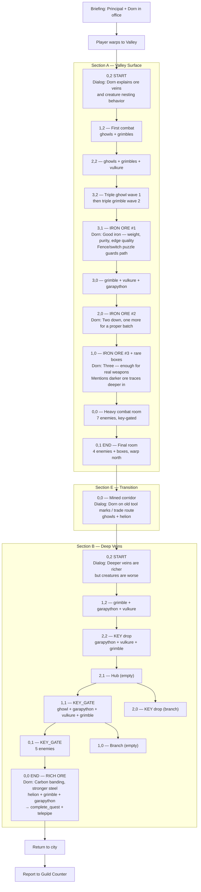

# Deep Ore Extraction — Quest Flow

## Overview

**Quest 5** | **Location:** Valley (gurhacia) | **Sections:** 3 (A → E → B)
**Companion:** Dorn (weapon smith's apprentice, HUcast model, orange nameplate)
**Requested by:** Weapon Smith | **Report to:** Guild Counter

The forge is cold — the settlement can't produce or repair weapons without raw iron, and the valley deposits are overrun with creatures. Dorn knows where the veins are but can't mine them alone. The player escorts him through the valley, clearing rooms so he can extract ore from four deposits: three iron ore in Section A and one rich ore in the final room of Section B.

## Objectives

| Item | Count | Location | Purpose |
|------|-------|----------|---------|
| Iron Ore | 3 | Section A (cells 3,1 / 2,0 / 1,0) | Base forging stock |
| Rich Ore | 1 | Section B final cell (0,0) | Carbon-banded core steel for photon weapons |

## Scenario Beats

The quest establishes the supply chain that keeps hunters equipped. Dorn isn't a fighter — he's a craftsman who knows metal. His dialog should feel practical and grounded: he talks about iron quality, oxidation, carbon banding, forge temperatures. He's not scared of the valley, just realistic about needing protection.

### Briefing (Principal's Office)

Dorn is standing at `pos_1` in the office. The Principal introduces the situation — the weapon smith filed an urgent material request. Dorn explains the forge has been cold for weeks and the downstream consequences (worn gear, no repairs, hunters at risk). He knows the vein locations. The player is assigned as escort.

### Section A — Valley Surface (12 cells, grid)

The main section. Player enters from the north and works south through creature-filled rooms. Three iron ore deposits are placed along the western spine of the map, each guarded by escalating enemies. A fence/switch puzzle gates the path between the ore deposits and the exit.

### Section E — Transition Corridor (1 cell)

A mined-out corridor connecting the surface to the deeper veins. Dorn comments on the old tool marks — this was a trade route before the collapse. Light combat (ghowls + helion mini-boss encounter).

### Section B — Deep Veins (9 cells, grid)

Harder enemies (more garapythons, helion at the end). The rich ore deposit is in the final cell behind two key-gates. Collecting it triggers `complete_quest` + `telepipe`.

## Quest Flow

## Dialog Script

### Briefing

| Speaker | Line |
|---------|------|
| Principal | The weapon smith has put in an urgent material request. This is Dorn, his apprentice. |
| Dorn | The forge has been cold for weeks. Can't make anything without raw iron, and the valley deposits are crawling with creatures. |
| Dorn | No new weapons, no repairs — hunters are going out with worn-down gear. It's only going to get worse. |
| Dorn | I know where the veins are. I just need someone to keep the creatures off me while I work. |
| Principal | No ore means no equipment. Get down there and bring back what we need. |

### Field Dialog

| Trigger | Speaker | Line |
|---------|---------|------|
| S0 Entry (0,2) | Dorn | The first vein should be just ahead. These creatures nest near mineral deposits — something in the ore attracts them. Clear the room, I'll handle the rest. |
| Iron Ore #1 (3,1) | Dorn | Good iron. You can tell by the weight — this hasn't oxidized at all. Most surface ore is rusted through, but the stuff buried deep stays pure. |
| | Dorn | A blade's only as good as what you forge it from. Junk iron makes junk steel — shatters on the first real hit. This? This'll hold an edge. |
| Iron Ore #2 (2,0) | Dorn | Another good vein. Two down — one more and we'll have enough to start a proper batch. |
| Iron Ore #3 (1,0) | Dorn | That's three. With this much raw stock, Master can forge something proper — not the salvage junk everyone's been carrying. |
| | Dorn | But I spotted traces of something deeper in. Darker ore, heavier. The kind you use for a weapon's core — the part that channels photon energy. Let's push through. |
| Transition (S1) | Dorn | See those tool marks on the walls? Miners worked this corridor. Before everything fell apart, this was a trade route. Now it's just us and whatever's living down here. |
| S2 Entry (0,2) | Dorn | The deeper veins are richer but the creatures are worse. Stay sharp. |
| Rich Ore (S2 0,0) | Dorn | This one's got a dark streak through it — that's carbon banding. Makes for stronger steel. The old smiths would've killed for stock like this. |
| | Dorn | That's everything we need. Let's get back to the shop. |

## Enemy Composition

### Section A (Valley Surface)
- **Early rooms:** ghowls + grimbles (basic valley enemies)
- **Mid rooms:** Add vulkures (flying threat, forces ranged attention)
- **Late rooms:** Add garapythons (tanky, punishing if ignored)
- **Wave 2 in most rooms** — ensures rooms aren't trivially one-shot

### Section E (Transition)
- ghowls + **helion** (elite enemy, mini-boss feel for transition)

### Section B (Deep Veins)
- Heavier mix from the start — garapythons + vulkures baseline
- **Helion in final room** — guards the rich ore deposit
- Two key-gates force the player to explore branches

## Editor Rebuild Notes

When remaking in the web editor:

1. **Section A layout** — 12 cells, linear spine with a loop. The three ore pickups should be spaced so the player feels progression (easy → medium → hard). The fence/switch in 3,1 should gate access to the ore deposits on the western side, creating a "clear the east, unlock the west" flow.

2. **Section E** — Single transition cell. Keep it simple: dialog trigger near entrance, small enemy group, boxes as loot.

3. **Section B layout** — 9 cells with two key-gates creating a branching puzzle. The rich ore is behind both gates in the deepest room. Player needs to find both keys before reaching it.

4. **Enemy placement** — Position enemies near ore/mineral props where possible to reinforce Dorn's line about creatures nesting near deposits.

5. **Boxes** — Normal boxes in combat rooms, rare boxes near the iron ore pickups (reward for reaching them). The final room gets a rare box alongside the rich ore.

6. **Dorn companion** — Should follow the player through all sections. His dialog triggers fire on room entry (sections A/E/B entry) and on quest item pickup.
