# Deep Ore Extraction — Quest Flow

## Overview

**Quest 5** | **Location:** Valley (gurhacia) | **Sections:** 3 (A → E → B)
**Companion:** Dorn (weapon smith's apprentice, HUcast model, orange nameplate)
**Requested by:** Weapon Smith | **Report to:** Guild Counter

The known mineral veins are running dry — the forge has been stretching Carlian stock for weeks, but there's nothing left worth smelting. New deposits need to be surveyed, but every prospecting team that's gone into the valley has been driven back by creatures. Dorn has been studying geological maps and thinks the deeper caves might have untapped veins. The Principal assigns the player as escort so Dorn can collect samples and assess whether a real mining operation is viable.

## Objectives

| Item | Count | Rarity | Location | Dorn's Assessment |
|------|-------|--------|----------|-------------------|
| Acenaline | 2 | r1 | Section A (early/mid cells) | Baseline compound — usable, keeps the forge running short-term |
| Peparian | 1 | r4 | Section A (late cell) | Unexpected — sturdy alloy normally found in snowfield/underground. The deeper deposits have real potential. |
| Dianaline | 1 | r4 | Section B final cell | Refined polymer, way above valley-grade. Justifies a proper mining claim. |

## Synthesis Connection

This quest introduces the player to crafting materials by handing them real ingredients:
- **Saber** (starter tier) = 2 Carlian + 1 Acenaline — they already have Carlian, now they have Acenaline
- **Brand** (mid tier) = 3 Peparian + 2 Dianaline — one of each found here, the player now knows these exist and where to farm them

## Scenario Beats

The quest is a prospecting expedition. Dorn isn't claiming to know where ore is — he's a student applying geological theory in the field. His arc is quiet: nervous → relieved → genuinely surprised. He's not a prophet, he's a kid with a survey map and a hammer, testing rocks in a monster-infested valley.

### Briefing (Principal's Office)

Dorn is standing at `pos_1`. The weapon smith filed an urgent material request — the known Carlian veins are depleted and the forge can't produce or repair equipment. Dorn has been studying geological surveys and thinks deeper caves in the valley might have untapped deposits, but every survey team that's gone out has been driven back. The Principal assigns the player as escort.

### Section A — Valley Surface (grid)

Player enters from the north. Dorn comments on reading the terrain for mineral traces. Two Acenaline deposits in the early-to-mid rooms — Dorn confirms they're usable but nothing special ("at least we know there's something out here"). One Peparian deposit in a later room behind a fence/switch puzzle — Dorn is surprised, this is better than expected. A warp at the end leads deeper.

### Section E — Transition Corridor (1 cell)

Connecting passage. Dorn notices old tool marks on the walls — miners worked here before the creatures moved in. Light combat.

### Section B — Deep Veins (grid)

Harder enemies. Two key-gates force exploration. The Dianaline deposit is in the final cell — Dorn has never seen material like this outside of a textbook. Collecting it triggers `complete_quest` + `telepipe`.

## Quest Flow

```mermaid
flowchart TD
    BRIEF[Briefing: Principal + Dorn in office] --> WARP[Player warps to Valley]

    subgraph SECTION_A [Section A — Valley Surface]
        A_START["Entry cell — START<br/>Dorn: Reading the terrain,<br/>mineral traces on the survey maps"]
        A_START --> A_COMBAT["Combat rooms<br/>ghowls + grimbles"]
        A_COMBAT --> A_ORE1["ACENALINE #1<br/>Dorn: Flexible compound, decent.<br/>The forge can work with this."]
        A_ORE1 --> A_MID["Mid combat rooms<br/>+ vulkures"]
        A_MID --> A_ORE2["ACENALINE #2<br/>Dorn: Same grade. At least we know<br/>there's material out here — more than<br/>the last three teams found."]
        A_ORE2 --> A_PUZZLE["Fence/switch puzzle"]
        A_PUZZLE --> A_ORE3["PEPARIAN<br/>Dorn: Wait — feel how dense this is.<br/>This isn't valley-grade. This is the kind<br/>of alloy you find in snowfield mines.<br/>The deposits get better further in."]
        A_ORE3 --> A_HEAVY["Heavy combat rooms<br/>+ garapythons"]
        A_HEAVY --> A_END["END — warp deeper"]
    end

    WARP --> A_START
    A_END --> TRANSITION

    subgraph SECTION_E [Section E — Transition]
        TRANSITION["Mined corridor<br/>Dorn: See the tool marks?<br/>Miners worked here before<br/>the creatures moved in.<br/>ghowls + helion"]
    end

    TRANSITION --> B_START

    subgraph SECTION_B [Section B — Deep Veins]
        B_START["Entry cell — START<br/>Dorn: If the surface had Peparian,<br/>the deep veins could have<br/>anything. Stay sharp."]
        B_START --> B_COMBAT["Combat rooms<br/>garapythons + vulkures"]
        B_COMBAT --> B_KEYS["Key-gate branches<br/>explore for keys"]
        B_KEYS --> B_FINAL["DIANALINE — END<br/>Dorn: I've never handled anything<br/>like this. This isn't valley ore —<br/>this is refined polymer.<br/>If there's a vein of this down here,<br/>it changes everything.<br/>→ complete_quest + telepipe"]
    end

    B_FINAL --> RETURN[Return to city]
    RETURN --> REPORT[Report to Guild Counter]
```

## Dialog Script

### Briefing

| Speaker | Line |
|---------|------|
| Principal | The weapon smith has put in an urgent material request. This is Dorn, his apprentice. |
| Dorn | The known veins are tapped out. We've been stretching the last of the Carlian for weeks, but there's nothing left worth smelting. |
| Dorn | No materials means no weapons, no repairs. Hunters are going out with worn-down gear. |
| Dorn | I've been going over the old geological surveys. The deeper caves in the valley have never been properly prospected — every team that's gone out has been driven back. |
| Dorn | I need someone to keep the creatures off me while I take samples. If the deposits are what I think they are, we can make a case for a real mining operation. |
| Principal | No ore means no equipment. Get down there and find out what we're working with. |

### Field Dialog

| Trigger | Speaker | Line |
|---------|---------|------|
| S0 Entry | Dorn | The mineral traces on the survey maps point this way. The creatures nest near deposits — something in the ore attracts them. If we find nests, we're probably close. |
| Acenaline #1 | Dorn | Acenaline. Flexible compound — the forge uses it as a binding agent. Not exciting, but we need it. |
| Acenaline #2 | Dorn | More Acenaline, same grade. At least we know there's material out here. That's more than the last three teams came back with. |
| Peparian | Dorn | Wait — feel how dense this is. This isn't valley-grade at all. |
| | Dorn | This is Peparian. Sturdy alloy — you normally only find it in snowfield mines or underground. Finding it here means the deeper deposits could have real potential. |
| Transition (S1) | Dorn | See those tool marks on the walls? Miners worked this passage before the creatures moved in. We're past where anyone's surveyed. |
| S2 Entry | Dorn | If the surface had Peparian, the deep veins could have anything. Stay sharp. |
| Dianaline (S2 final) | Dorn | ...I've never handled anything like this outside of a textbook. This is Dianaline — refined polymer. Way above anything we expected to find in the valley. |
| | Dorn | If there's a vein of this down here, it changes everything for the forge. Let's get these samples back. |

## Enemy Composition

### Section A (Valley Surface)
- **Early rooms:** ghowls + grimbles (basic valley enemies)
- **Mid rooms:** Add vulkures (flying threat, forces ranged attention)
- **Late rooms:** Add garapythons (tanky, punishing if ignored)
- **Wave 2 in most rooms** — ensures rooms aren't trivially one-shot

### Section E (Transition)
- ghowls + **helion** (elite enemy, mini-boss feel for transition)

### Section B (Deep Veins)
- Heavier mix from the start — garapythons + vulkures baseline
- **Helion in final room** — guards the Dianaline deposit
- Two key-gates force the player to explore branches

## Editor Rebuild Notes

When remaking in the web editor:

1. **Objective items** — Change quest item IDs from `iron_ore`/`rich_ore` to `acenaline` (x2), `peparian` (x1), `dianaline` (x1). Update objective labels accordingly.

2. **Section A layout** — Grid section. Two Acenaline pickups in early/mid rooms, Peparian behind a fence/switch puzzle in a later room. The quality gradient should track with difficulty — better materials are deeper in.

3. **Section E** — Single transition cell. Dialog trigger near entrance, small enemy group, boxes.

4. **Section B layout** — Grid section with two key-gates. Dianaline in the deepest room behind both gates. Player needs to find both keys before reaching it.

5. **Enemy placement** — Position enemies near ore/mineral areas where possible to reinforce Dorn's line about creatures nesting near deposits.

6. **Boxes** — Normal boxes in combat rooms, rare boxes near the material pickups. Final room gets a rare box alongside the Dianaline.

7. **Dorn companion** — Follows the player through all sections. Dialog triggers fire on room entry (section starts) and on quest item pickup.
