# Messages from the Past — Quest Flow

## Overview

**Quest 6** | **Location:** Paru ruins (paru) | **Sections:** 3 (A → E → B)
**Companion:** Elio (Mira's research assistant) | **Office NPCs:** Mira (pos_1), Elio (pos_2)
**Requested by:** Research Division | **Report to:** Guild Counter

A pre-Great-Blank civilization once lived on Paru and left technology behind in the ruins — including data disks that might explain what happened to this world. A survey team confirmed intact disks exist but turned back when the ruins' dormant automata reactivated. Mira (Research Division lead) can read the disks but isn't combat-trained, so she sends her assistant Elio with the player. Elio knows what to look for; the player keeps both of them alive.

This is the first **classified** quest the player takes — the briefing opens with the Principal saying so explicitly. It's also the first time the lore acknowledges that the Great Blank wasn't just a natural disaster.

## Objectives

The objective is **read all 4 message logs** scattered through the ruins. The logs are `message` element types (the existing scrolling-scroll prop), not pickups — the player walks up, presses interact, the popup shows the text, and Elio reacts via speech bubble. Each message has an `objective_item_id: "message_log"` field that ticks `SessionManager.collect_quest_item("message_log")` on first read; quest auto-completes when count hits target=4.

| # | Location (current JSON) | Log content | Elio's reaction |
|---|--------------------------|-------------|-----------------|
| 1 | Section A — cell 3,3 | Survey log fragment 14: site holds, deeper galleries intact, dormant infrastructure | "This was a survey, not an excavation. They expected to come back." |
| 2 | Section A — cell 4,0 | Personnel directive: evacuation order rescinded, Council silence | "They were evacuating something. And then they weren't." |
| 3 | Section B — cell 2,3 | Personal log, name redacted: hands shaking, "we knew, we all knew" | "...I want to keep going. Mira needs to hear this." |
| 4 | Section B — cell 1,0 | Climactic transmission, corrupted: "we did this to ours██ves... burning ev█rything..." | "...They did this to themselves. I... I need to process this." |

**Confirmed approach:** all 4 messages required, picked up in any order, quest auto-completes when all 4 are read. The mechanic uses `MessagePack.objective_item_id` wired to `SessionManager.collect_quest_item` — re-reading a message doesn't re-tick the objective (an `objective_counted` meta flag gates it). On completion, `_on_quest_completed` already unlocks objective-locked area exits, so the player walks back through whichever exit their quest is set up to gate.

**Narrative caveat:** message 4 is the climax ("we did this to ours██ves... burning everything"). If the player reads message 4 first, the climax lands without buildup. Going with "any order" per the design call — flagging in case it's worth revisiting after a playtest. Could rewrite logs 1-3 to stand alone if needed.

## Lore Connection

This quest plants the first explicit hint about what the Great Blank was. The audio fragments on disks 3 and 4 imply the prior civilization caused their own collapse ("we did this to ourselves... there was no one left to fight... just us, burning everything"). Subsequent quests can build on this without recontextualizing it — the audio is unambiguous about agency, deliberately ambiguous about *what* they did.

Other touch points:
- Reinforces Mira/Elio as the Research Division pair — they recur in later quests if we want a research arc.
- Establishes the **paru ruins** as a place where pre-Blank artifacts can be recovered. Future quests in paru can lean on the player already knowing this.

## Scenario Beats

### Briefing (Principal's Office)

Mira (`pos_1`) and Elio (`pos_2`). Principal opens by stamping the mission classified — the first time the player sees this. Mira explains the ruins contain pre-Blank data and a survey team confirmed intact disks exist. She'd recover them herself but the automata are too dangerous; Elio goes in her place. Elio is trained on Mira's notes and can identify the right disks; the player keeps the team alive.

### Section A — Outer Ruins (grid)

Player enters from the north. Elio comments on the survey team turning back here. Two data disks (1 and 2). One key gate forces a small detour for the second disk. Elio's reactions are technical and steady — these disks are what the survey predicted, no surprises. Light to medium combat (automata-themed enemies).

### Section E — Inner Threshold (1 cell)

Connecting room. Elio remarks they're past the survey's farthest point — anything beyond is uncatalogued.

**Confirmed approach:** section E should host a mini-boss-tier automaton, same role Helion plays in Q5's transition room. The model will be ported from PSOBB (TBD which one) — until that asset extraction lands, the room keeps its current heavier-wave content (bolix + froutang + bolix) as a placeholder. After the PSOBB asset is in, the room becomes single-mini-boss + maybe one or two adds, with a room_clear callout from Elio about "whatever was guarding this was still on duty after centuries."

### Section B — Inner Sanctum (grid)

Heavier enemies, two key gates. Disk 3 is mid-section behind a locked door — pickup plays a corrupted audio fragment, and Elio's tone shifts (she's been trained on the surface stuff but this is unfamiliar). Disk 4 is in the final cell — second audio fragment plays, then Elio's "they did this to themselves" line. Pickup triggers `end_quest` (auto-marks complete + spawns return telepipe regardless of objectives_met, same pattern as Q5's Dianaline).

## Quest Flow

```mermaid
flowchart TD
    BRIEF["Briefing: Principal stamps it classified<br/>Mira: We need the disks but I can't go<br/>Elio: I'll know them when I see them"]
    BRIEF --> WARP[Player + Elio warp to Paru ruins]

    subgraph SECTION_A [Section A — Outer Ruins]
        A_START["Entry cell — START<br/>Elio: Survey team turned back here.<br/>They weren't equipped for the automata.<br/>We are."]
        A_START --> A_COMBAT1["Combat rooms<br/>automata waves"]
        A_COMBAT1 --> A_DISK1["DATA DISK 1<br/>Elio: Housing is intact.<br/>This is what Mira described."]
        A_DISK1 --> A_KEYGATE["Key gate<br/>(key drops in side cell)"]
        A_KEYGATE --> A_DISK2["DATA DISK 2<br/>Elio: Different format from disk 1.<br/>Whoever stored these wanted redundancy."]
        A_DISK2 --> A_END["END — warp deeper"]
    end

    WARP --> A_START

    subgraph SECTION_E [Section E — Inner Threshold]
        E_ENTRY["Single cell<br/>Elio: We're past where the survey reached.<br/>Anything beyond is uncatalogued."]
        E_ENTRY --> E_COMBAT["Heavy wave / mini-boss automaton"]
        E_COMBAT --> E_CLEAR["ROOM CLEAR<br/>Elio: Whatever guarded this place<br/>was still on duty."]
    end

    A_END --> E_ENTRY

    subgraph SECTION_B [Section B — Inner Sanctum]
        B_START["Entry cell<br/>Elio: This isn't ruins anymore.<br/>This was somewhere people lived."]
        B_START --> B_COMBAT1["Combat rooms<br/>+ heavier automata"]
        B_COMBAT1 --> B_KEYGATE1["First key gate"]
        B_KEYGATE1 --> B_DISK3["DATA DISK 3<br/>(audio fragment plays — corrupted)<br/>Elio: ...this isn't survey data.<br/>This is a personal log."]
        B_DISK3 --> B_KEYGATE2["Second key gate"]
        B_KEYGATE2 --> B_FINAL["Final cell"]
        B_FINAL --> B_DISK4["DATA DISK 4<br/>(audio: 'we did this to ours██ves...<br/>just us, burning everything...')<br/>Elio: ...They did this to themselves.<br/>I... I need to process this."]
        B_DISK4 --> B_END["end_quest action fires<br/>→ telepipe spawns"]
    end

    E_CLEAR --> B_START
    B_END --> RETURN[Telepipe → Guild Counter]
    RETURN --> REPORT["Report to Guild<br/>Mira receives disks<br/>(reward: data analysis bonus exp/meseta)"]
```

## Decisions (resolved)

1. **Disks:** all 4 required, picked up in any order, quest ends only when all 4 are collected. Existing per-pickup `complete_quest` + `telepipe` actions stay (they're gated on `objectives_met` so only the actual last pickup triggers the telepipe).
2. **Section E mini-boss:** import a PSOBB enemy model (TBD which). Until that asset lands, current bolix/froutang wave stays as placeholder.
3. **Reward:** standard guild XP/meseta, no story unlock.
4. **Mira/Elio recurrence:** designed as the Research Division pair so they can recur in later paru quests. Mira stays in the office and delegates; Elio is the field assistant. This quest establishes both characters but commits to nothing further.

## Known Issues in the Current JSON (to fix during the editor pass)

- **Speaker tags say "Mira" everywhere in-quest.** The companion is Elio — Mira stays in the office. Every in-quest `"speaker": "Mira"` should be `"speaker": "Elio"`. (8 occurrences.) The empty-speaker line on disk 4 (`"speaker": ""`) is intentional — it's the corrupted recording playing, not a character.
- Last disk uses `["complete_quest", "telepipe"]` actions. Per the Q5 pattern this should switch to `["end_quest"]` once we know whether any disks are optional. If all 4 stay required, the existing pair works fine.
