# Messages from the Past — Quest Flow

## Overview

**Quest 6** | **Location:** Paru ruins (paru) | **Sections:** 3 (A → E → B)
**Companion:** Elio (Mira's research assistant) | **Office NPCs:** Mira (pos_1), Elio (pos_2)
**Requested by:** Research Division | **Report to:** Guild Counter

A pre-Great-Blank civilization once lived on Paru and left technology behind in the ruins. The Research Division is running an active **excavation** — they're cataloguing what they find, and ancient logs that might explain what happened to this world keep turning up in the deeper galleries. Mira (Research Division lead) can read the logs but isn't combat-trained, so she sends her assistant Elio with the player. Elio knows what to look for; the player keeps both of them alive.

This is the first **classified** quest the player takes — the briefing opens with the Principal saying so explicitly. It's also the first time the lore acknowledges that the Great Blank wasn't just a natural disaster.

## Objectives

The objective is **read all 4 message logs** scattered through the ruins. The logs are `message` element types (the existing scrolling-scroll prop), not pickups — the player walks up, presses interact, the popup shows the text, and Elio reacts via speech bubble. Each message has an `objective_item_id: "message_log"` field that ticks `SessionManager.collect_quest_item("message_log")` on first read; quest auto-completes when count hits target=4.

| # | Location (current JSON) | Log content | Elio's reaction |
|---|--------------------------|-------------|-----------------|
| 1 | Section A — cell 3,3 | Operations log: deep galleries cleared, dormant infrastructure, automata still active | "They knew what they had — and they knew it was dangerous. They just didn't know what to do about it." |
| 2 | Section A — cell 4,0 | Personnel directive: evacuation rescinded, Council silence on jurisdiction | "They were evacuating something. Then they weren't. The Council just stopped answering." |
| 3 | Section B — cell 2,3 | Personal log, name redacted: hands shaking, "we knew, we all knew" | "...I want to keep going. Mira needs to hear this." |
| 4 | Section B — cell 1,0 | Climactic transmission, corrupted: "we did this to ours██ves... burning ev█rything..." | "...They did this to themselves. I... I need to process this." |

**Confirmed approach:** all 4 messages required, read in any order, quest auto-completes when all 4 are read. The mechanic uses `MessagePack.objective_item_id` wired to `SessionManager.collect_quest_item` — re-reading a message doesn't re-tick the objective (an `objective_counted` meta flag gates it).

**No hand-holding:** the player has to actually find the messages. No quest marker, no minimap pin pointing at unread logs, no auto-unlock that opens a shortcut to the next room. The section's exit warps must be marked **objective-locked** in the quest editor — `_on_quest_completed` will unlock them once all 4 reads land. If the player reaches the locked exit with messages still missing, they backtrack through the rooms until they find the ones they walked past.

**Narrative caveat:** message 4 is the climax ("we did this to ours██ves... burning everything"). If the player reads message 4 first, the climax lands without buildup. Going with "any order" per the design call — flagging in case it's worth revisiting after a playtest. Could rewrite logs 1-3 to stand alone if needed.

## Lore Connection

This quest plants the first explicit hint about what the Great Blank was. The corrupted personal log (#3) and the climactic transmission (#4) imply the prior civilization caused their own collapse ("we did this to ours██ves... burning ev█rything..."). Subsequent quests can build on this without recontextualizing it — the messages are unambiguous about agency, deliberately ambiguous about *what* they did.

Other touch points:
- Reinforces Mira/Elio as the Research Division pair — they recur in later quests if we want a research arc.
- Establishes the **paru ruins** as a place where pre-Blank artifacts can be recovered. Future quests in paru can lean on the player already knowing this.

## Scenario Beats

### Briefing (Principal's Office)

Mira (`pos_1`) and Elio (`pos_2`). Principal opens by stamping the mission classified — the first time the player sees this. Mira explains the ruins contain pre-Blank message logs and a survey team confirmed intact ones exist. She'd read them herself but the automata are too dangerous; Elio goes in her place. Elio is trained on Mira's notes and can identify the right logs; the player keeps the team alive.

### Section A — Outer Ruins (grid)

Player enters from the north. Elio comments on the survey team turning back here. Two message logs (1 and 2). One key gate forces a small detour for the second log. Elio's reactions are technical and steady — these are what the survey predicted, no surprises. Light to medium combat (automata-themed enemies).

### Section E — Inner Threshold (1 cell)

Connecting room. Elio remarks they're past the survey's farthest point — anything beyond is uncatalogued. Hosts a Sinow Beat (ported from PSOv2) as the mini-boss, same structural role Helion plays in Q5's transition room.

### Section B — Inner Sanctum (grid)

Heavier enemies, two key gates. Message log 3 is mid-section — Elio's tone shifts when she reads it (she's been trained on the surface stuff but this is unfamiliar). Message log 4 is in the final cell — climactic corrupted transmission, then Elio's "they did this to themselves" line. Reading the 4th log auto-completes the quest and spawns the return telepipe.

## Quest Flow

```mermaid
flowchart TD
    BRIEF["Briefing: Principal stamps it classified<br/>Mira: We need the logs but I can't go<br/>Elio: I'll know them when I see them"]
    BRIEF --> WARP[Player + Elio warp to Paru ruins]

    subgraph SECTION_A [Section A — Outer Ruins]
        A_START["Entry cell — START<br/>Elio: Survey team turned back here.<br/>They weren't equipped for the automata.<br/>We are."]
        A_START --> A_COMBAT1["Combat rooms<br/>automata waves"]
        A_COMBAT1 --> A_LOG1["MESSAGE LOG 1<br/>Operations log — automata still active<br/>Elio: They knew it was dangerous.<br/>They just didn't know what to do."]
        A_LOG1 --> A_KEYGATE["Key gate<br/>(key drops in side cell)"]
        A_KEYGATE --> A_LOG2["MESSAGE LOG 2<br/>Personnel directive — Council silence<br/>Elio: They were evacuating something.<br/>Then they weren't."]
        A_LOG2 --> A_END["END — warp deeper"]
    end

    WARP --> A_START

    subgraph SECTION_E [Section E — Inner Threshold]
        E_ENTRY["Single cell<br/>Elio: We're past where the survey reached.<br/>Anything beyond is uncatalogued."]
        E_ENTRY --> E_COMBAT["Sinow Beat mini-boss"]
        E_COMBAT --> E_CLEAR["ROOM CLEAR<br/>Elio: Whatever guarded this place<br/>was still on duty."]
    end

    A_END --> E_ENTRY

    subgraph SECTION_B [Section B — Inner Sanctum]
        B_START["Entry cell<br/>Elio: This isn't ruins anymore.<br/>This was somewhere people lived."]
        B_START --> B_COMBAT1["Combat rooms<br/>+ heavier automata"]
        B_COMBAT1 --> B_KEYGATE1["First key gate"]
        B_KEYGATE1 --> B_LOG3["MESSAGE LOG 3<br/>Personal log — name redacted, hands shaking<br/>Elio: ...I want to keep going.<br/>Mira needs to hear this."]
        B_LOG3 --> B_KEYGATE2["Second key gate"]
        B_KEYGATE2 --> B_FINAL["Final cell"]
        B_FINAL --> B_LOG4["MESSAGE LOG 4 (climax)<br/>'we did this to ours██ves...<br/>burning ev█rything...'<br/>Elio: ...They did this to themselves.<br/>I... I need to process this."]
        B_LOG4 --> B_END["Quest auto-completes<br/>→ telepipe spawns"]
    end

    E_CLEAR --> B_START
    B_END --> RETURN[Telepipe → Guild Counter]
    RETURN --> REPORT["Report to Guild<br/>(reward: standard guild XP/meseta)"]
```

## Decisions (resolved)

1. **Logs:** all 4 required, read in any order. Per-message `objective_item_id: "message_log"` ticks `SessionManager.collect_quest_item`; quest auto-completes when count hits 4, which fires the deferred return telepipe via `_on_quest_completed`.
2. **Section E mini-boss:** Sinow Beat (ported from PSOv2 — model + animations + textures live under `assets/enemies/shinowa/`).
3. **Reward:** standard guild XP/meseta, no story unlock.
4. **Mira/Elio recurrence:** designed as the Research Division pair so they can recur in later paru quests. Mira stays in the office and delegates; Elio is the field assistant. This quest establishes both characters but commits to nothing further.
